# Diagrams

All diagrams are [Mermaid](https://mermaid.js.org) and render on GitHub and in most Markdown viewers. They describe the code as it is today; dashed or red elements mark intended-but-unwired parts (see [known-gaps.md](known-gaps.md)).

Contents: 1 System topology · 2 Package dependencies · 3 Ingestion sequence · 4 Q&A sequence · 5 Job state machine · 6 Document state machine · 7 ER diagram · 8 Ports and adapters · 9 LLM provider classes · 10 Agent runtime classes · 11 Worker pipeline · 12 Chunking · 13 Extractor selection · 14 Tenant isolation · 15 Error propagation · 16 Configuration flow · 17 Local deployment · 18 Migrations · 19 Current vs intended retrieval · 20 Web UI flow · 21 Test layout · 22 Extension points

---

## 1. System topology

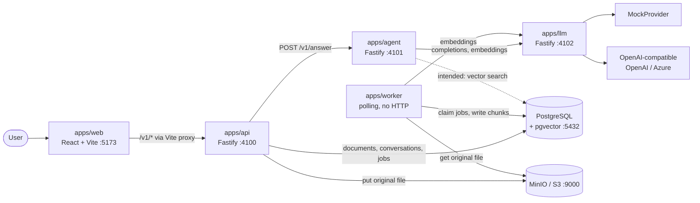
```mermaid
flowchart LR
    user([User]) --> web["apps/web<br/>React + Vite :5173"]
    web -- "/v1/* via Vite proxy" --> api["apps/api<br/>Fastify :4100"]
    api -- "POST /v1/answer" --> agent["apps/agent<br/>Fastify :4101"]
    agent -- "completions, embeddings" --> llm["apps/llm<br/>Fastify :4102"]
    llm --> mock["MockProvider"]
    llm --> oai["OpenAI-compatible<br/>OpenAI / Azure"]
    api -- "documents, conversations, jobs" --> pg[("PostgreSQL<br/>+ pgvector :5432")]
    api -- "put original file" --> minio[("MinIO / S3 :9000")]
    worker["apps/worker<br/>polling, no HTTP"] -- "claim jobs, write chunks" --> pg
    worker -- "get original file" --> minio
    worker -- "embeddings" --> llm
    agent -. "intended: vector search" .-> pg
```

## 2. Package dependencies

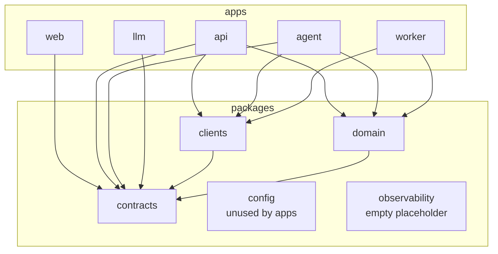
```mermaid
flowchart TD
    subgraph apps
        web[web]
        api[api]
        agent[agent]
        llm[llm]
        worker[worker]
    end
    subgraph packages
        clients[clients]
        domain[domain]
        contracts[contracts]
        config["config<br/>unused by apps"]
        obs["observability<br/>empty placeholder"]
    end
    web --> contracts
    api --> clients
    api --> domain
    api --> contracts
    agent --> clients
    agent --> domain
    agent --> contracts
    llm --> contracts
    worker --> clients
    worker --> domain
    clients --> contracts
    domain --> contracts
```

## 3. Document ingestion sequence

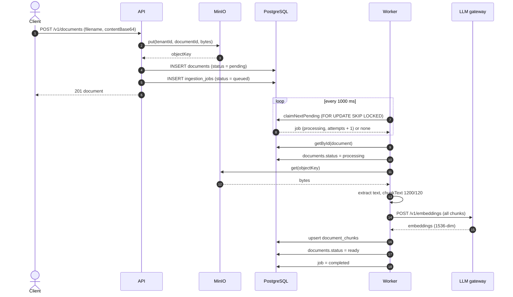
```mermaid
sequenceDiagram
    autonumber
    actor C as Client
    participant API as API
    participant OS as MinIO
    participant DB as PostgreSQL
    participant W as Worker
    participant L as LLM gateway

    C->>API: POST /v1/documents (filename, contentBase64)
    API->>OS: put(tenantId, documentId, bytes)
    OS-->>API: objectKey
    API->>DB: INSERT documents (status = pending)
    API->>DB: INSERT ingestion_jobs (status = queued)
    API-->>C: 201 document

    loop every 1000 ms
        W->>DB: claimNextPending (FOR UPDATE SKIP LOCKED)
        DB-->>W: job (processing, attempts + 1) or none
    end

    W->>DB: getById(document)
    W->>DB: documents.status = processing
    W->>OS: get(objectKey)
    OS-->>W: bytes
    W->>W: extract text, chunkText 1200/120
    W->>L: POST /v1/embeddings (all chunks)
    L-->>W: embeddings (1536-dim)
    W->>DB: upsert document_chunks
    W->>DB: documents.status = ready
    W->>DB: job = completed
```

## 4. Question answering sequence

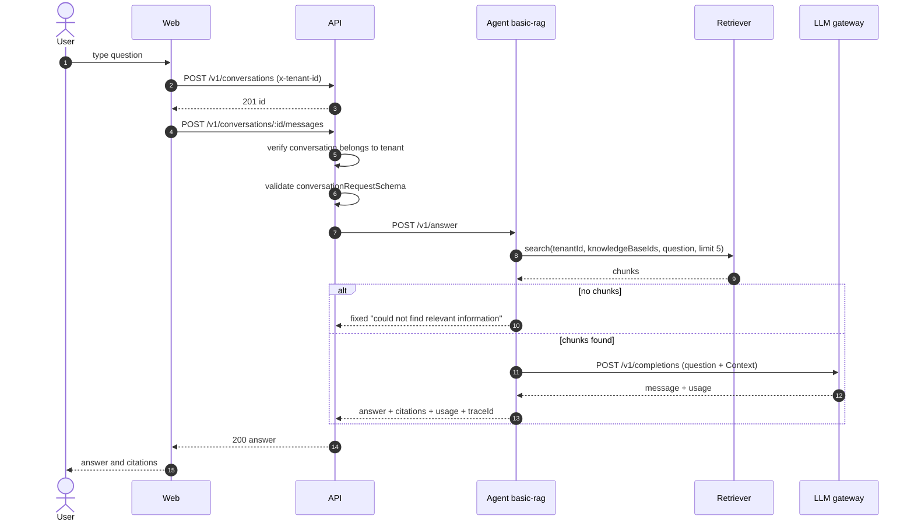
```mermaid
sequenceDiagram
    autonumber
    actor U as User
    participant Web as Web
    participant API as API
    participant A as Agent basic-rag
    participant R as Retriever
    participant L as LLM gateway

    U->>Web: type question
    Web->>API: POST /v1/conversations (x-tenant-id)
    API-->>Web: 201 id
    Web->>API: POST /v1/conversations/:id/messages
    API->>API: verify conversation belongs to tenant
    API->>API: validate conversationRequestSchema
    API->>A: POST /v1/answer
    A->>R: search(tenantId, knowledgeBaseIds, question, limit 5)
    R-->>A: chunks
    alt no chunks
        A-->>API: fixed "could not find relevant information"
    else chunks found
        A->>L: POST /v1/completions (question + Context)
        L-->>A: message + usage
        A-->>API: answer + citations + usage + traceId
    end
    API-->>Web: 200 answer
    Web-->>U: answer and citations
```

## 5. Ingestion job state machine

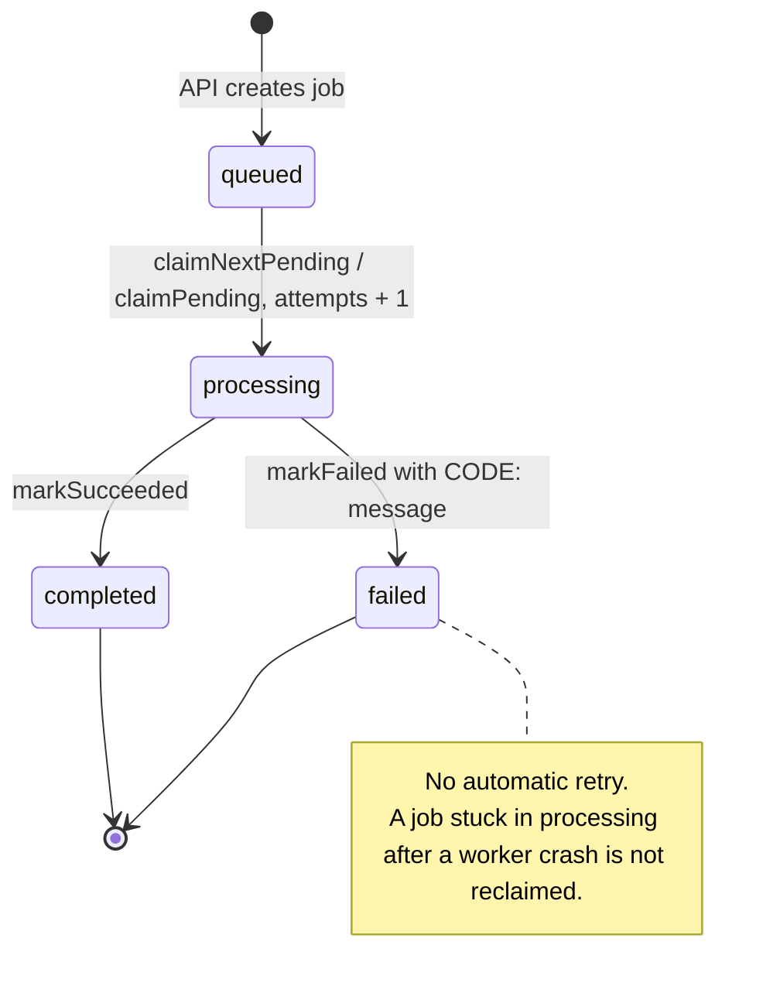
```mermaid
stateDiagram-v2
    [*] --> queued: API creates job
    queued --> processing: claimNextPending / claimPending, attempts + 1
    processing --> completed: markSucceeded
    processing --> failed: markFailed with CODE: message
    completed --> [*]
    failed --> [*]
    note right of failed
        No automatic retry.
        A job stuck in processing after a worker crash is not reclaimed.
    end note
```

## 6. Document status state machine

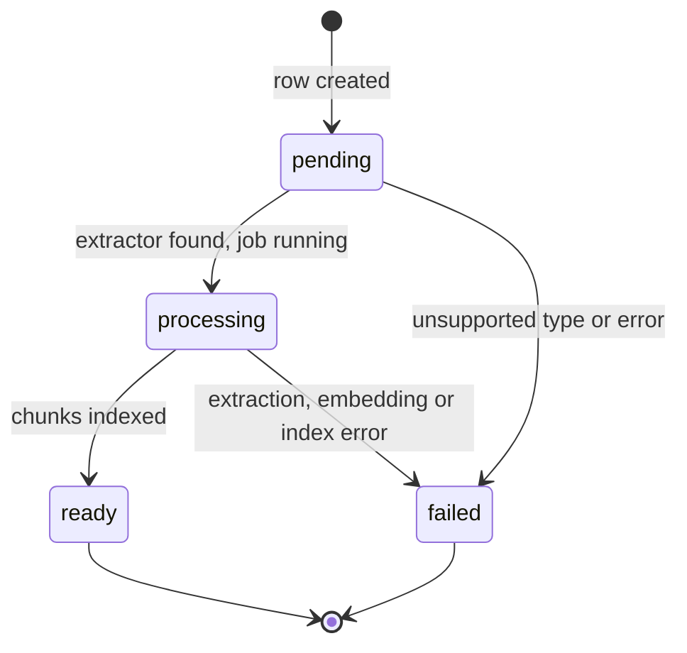
```mermaid
stateDiagram-v2
    [*] --> pending: row created
    pending --> processing: extractor found, job running
    pending --> failed: unsupported type or error
    processing --> ready: chunks indexed
    processing --> failed: extraction, embedding or index error
    ready --> [*]
    failed --> [*]
```

## 7. Entity-relationship diagram

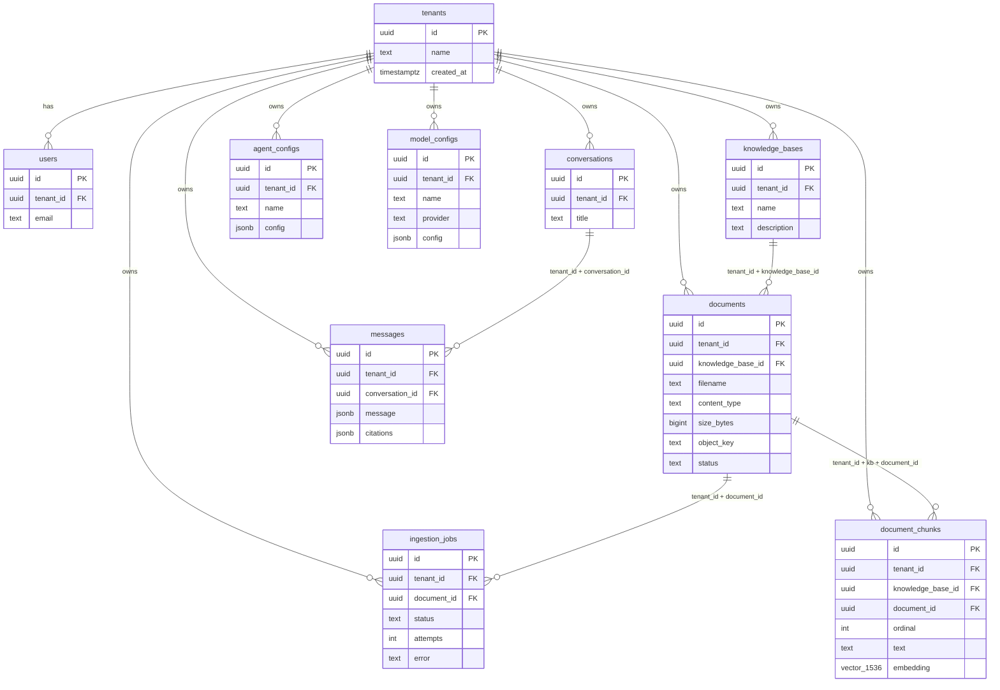
```mermaid
erDiagram
    tenants ||--o{ users : has
    tenants ||--o{ knowledge_bases : owns
    tenants ||--o{ documents : owns
    tenants ||--o{ conversations : owns
    tenants ||--o{ messages : owns
    tenants ||--o{ agent_configs : owns
    tenants ||--o{ model_configs : owns
    tenants ||--o{ ingestion_jobs : owns
    tenants ||--o{ document_chunks : owns
    knowledge_bases ||--o{ documents : "tenant_id + knowledge_base_id"
    documents ||--o{ ingestion_jobs : "tenant_id + document_id"
    documents ||--o{ document_chunks : "tenant_id + kb + document_id"
    conversations ||--o{ messages : "tenant_id + conversation_id"

    tenants {
        uuid id PK
        text name
        timestamptz created_at
    }
    users {
        uuid id PK
        uuid tenant_id FK
        text email
    }
    knowledge_bases {
        uuid id PK
        uuid tenant_id FK
        text name
        text description
    }
    documents {
        uuid id PK
        uuid tenant_id FK
        uuid knowledge_base_id FK
        text filename
        text content_type
        bigint size_bytes
        text object_key
        text status
    }
    ingestion_jobs {
        uuid id PK
        uuid tenant_id FK
        uuid document_id FK
        text status
        int attempts
        text error
    }
    document_chunks {
        uuid id PK
        uuid tenant_id FK
        uuid knowledge_base_id FK
        uuid document_id FK
        int ordinal
        text text
        vector_1536 embedding
    }
    conversations {
        uuid id PK
        uuid tenant_id FK
        text title
    }
    messages {
        uuid id PK
        uuid tenant_id FK
        uuid conversation_id FK
        jsonb message
        jsonb citations
    }
    agent_configs {
        uuid id PK
        uuid tenant_id FK
        text name
        jsonb config
    }
    model_configs {
        uuid id PK
        uuid tenant_id FK
        text name
        text provider
        jsonb config
    }
```

## 8. Ports and adapters (packages/domain)

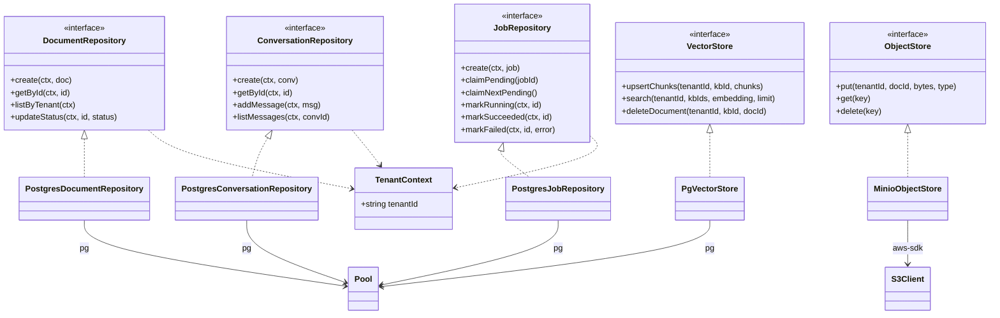
```mermaid
classDiagram
    class TenantContext {
        +string tenantId
    }
    class DocumentRepository {
        <<interface>>
        +create(ctx, doc)
        +getById(ctx, id)
        +listByTenant(ctx)
        +updateStatus(ctx, id, status)
    }
    class ConversationRepository {
        <<interface>>
        +create(ctx, conv)
        +getById(ctx, id)
        +addMessage(ctx, msg)
        +listMessages(ctx, convId)
    }
    class JobRepository {
        <<interface>>
        +create(ctx, job)
        +claimPending(jobId)
        +claimNextPending()
        +markRunning(ctx, id)
        +markSucceeded(ctx, id)
        +markFailed(ctx, id, error)
    }
    class VectorStore {
        <<interface>>
        +upsertChunks(tenantId, kbId, chunks)
        +search(tenantId, kbIds, embedding, limit)
        +deleteDocument(tenantId, kbId, docId)
    }
    class ObjectStore {
        <<interface>>
        +put(tenantId, docId, bytes, type)
        +get(key)
        +delete(key)
    }
    DocumentRepository <|.. PostgresDocumentRepository
    ConversationRepository <|.. PostgresConversationRepository
    JobRepository <|.. PostgresJobRepository
    VectorStore <|.. PgVectorStore
    ObjectStore <|.. MinioObjectStore
    DocumentRepository ..> TenantContext
    ConversationRepository ..> TenantContext
    JobRepository ..> TenantContext
    PostgresDocumentRepository --> Pool : pg
    PostgresConversationRepository --> Pool : pg
    PostgresJobRepository --> Pool : pg
    PgVectorStore --> Pool : pg
    MinioObjectStore --> S3Client : aws-sdk
```

## 9. LLM provider classes (apps/llm)

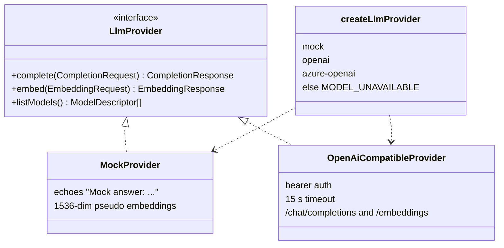
```mermaid
classDiagram
    class LlmProvider {
        <<interface>>
        +complete(CompletionRequest) CompletionResponse
        +embed(EmbeddingRequest) EmbeddingResponse
        +listModels() ModelDescriptor[]
    }
    class MockProvider {
        echoes "Mock answer: ..."
        1536-dim pseudo embeddings
    }
    class OpenAiCompatibleProvider {
        bearer auth
        15 s timeout
        /chat/completions and /embeddings
    }
    LlmProvider <|.. MockProvider
    LlmProvider <|.. OpenAiCompatibleProvider
    class createLlmProvider {
        mock
        openai
        azure-openai
        else MODEL_UNAVAILABLE
    }
    createLlmProvider ..> MockProvider
    createLlmProvider ..> OpenAiCompatibleProvider
```

## 10. Agent runtime classes (apps/agent)

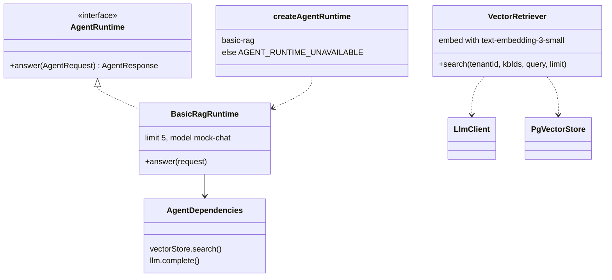
```mermaid
classDiagram
    class AgentRuntime {
        <<interface>>
        +answer(AgentRequest) AgentResponse
    }
    class BasicRagRuntime {
        +answer(request)
        limit 5, model mock-chat
    }
    class AgentDependencies {
        vectorStore.search()
        llm.complete()
    }
    class VectorRetriever {
        +search(tenantId, kbIds, query, limit)
        embed with text-embedding-3-small
    }
    class createAgentRuntime {
        basic-rag
        else AGENT_RUNTIME_UNAVAILABLE
    }
    AgentRuntime <|.. BasicRagRuntime
    BasicRagRuntime --> AgentDependencies
    VectorRetriever ..> LlmClient
    VectorRetriever ..> PgVectorStore
    createAgentRuntime ..> BasicRagRuntime
```

## 11. Worker pipeline

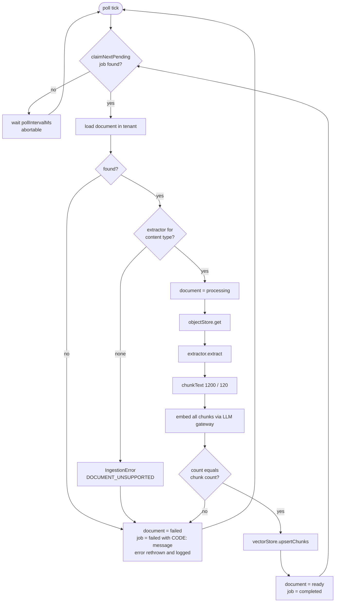
```mermaid
flowchart TD
    start([poll tick]) --> claim{"claimNextPending<br/>job found?"}
    claim -- no --> sleep["wait pollIntervalMs<br/>abortable"] --> start
    claim -- yes --> load["load document in tenant"]
    load --> found{found?}
    found -- no --> fail
    found -- yes --> pick{"extractor for<br/>content type?"}
    pick -- none --> unsupported["IngestionError<br/>DOCUMENT_UNSUPPORTED"] --> fail
    pick -- yes --> proc["document = processing"]
    proc --> get["objectStore.get"]
    get --> ext["extractor.extract"]
    ext --> chunk["chunkText 1200 / 120"]
    chunk --> emb["embed all chunks via LLM gateway"]
    emb --> count{"count equals<br/>chunk count?"}
    count -- no --> fail
    count -- yes --> up["vectorStore.upsertChunks"]
    up --> ready["document = ready<br/>job = completed"] --> claim
    fail["document = failed<br/>job = failed with CODE: message<br/>error rethrown and logged"] --> start
```

## 12. Chunking with overlap

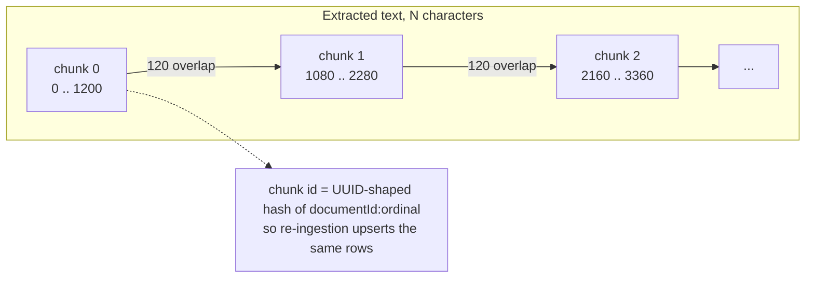
```mermaid
flowchart LR
    subgraph text["Extracted text, N characters"]
        direction LR
        c0["chunk 0<br/>0 .. 1200"]
        c1["chunk 1<br/>1080 .. 2280"]
        c2["chunk 2<br/>2160 .. 3360"]
        cn["..."]
    end
    c0 -- "120 overlap" --> c1 -- "120 overlap" --> c2 --> cn
    id["chunk id = UUID-shaped hash of documentId:ordinal<br/>so re-ingestion upserts the same rows"]
    c0 -.-> id
```

## 13. Extractor selection

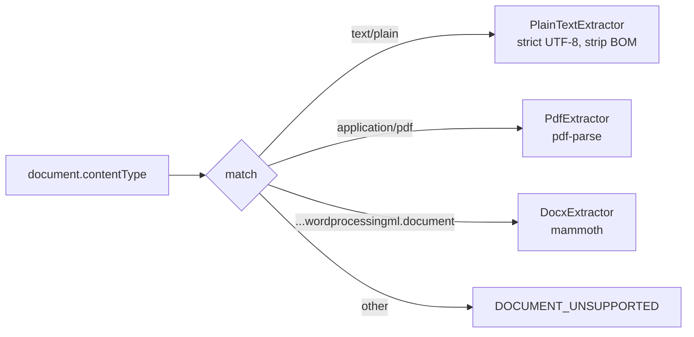
```mermaid
flowchart LR
    doc["document.contentType"] --> t{match}
    t -- "text/plain" --> txt["PlainTextExtractor<br/>strict UTF-8, strip BOM"]
    t -- "application/pdf" --> pdf["PdfExtractor<br/>pdf-parse"]
    t -- "...wordprocessingml.document" --> docx["DocxExtractor<br/>mammoth"]
    t -- other --> no["DOCUMENT_UNSUPPORTED"]
```

## 14. Tenant isolation layers

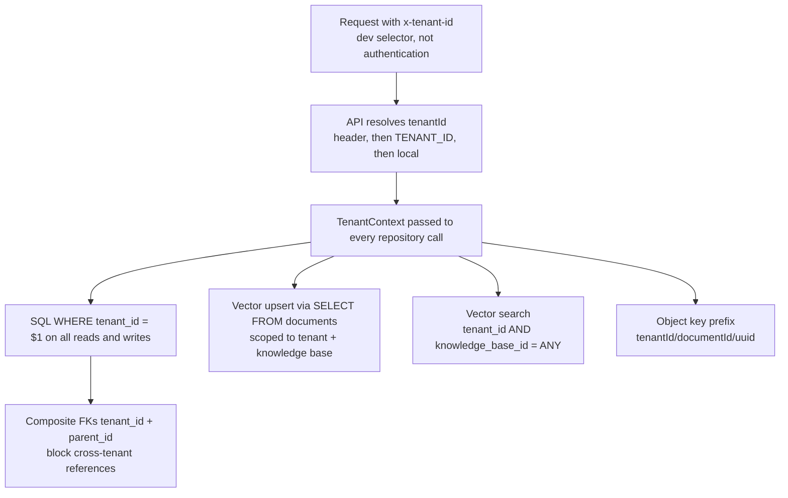
```mermaid
flowchart TD
    req["Request with x-tenant-id<br/>dev selector, not authentication"] --> res["API resolves tenantId<br/>header, then TENANT_ID, then local"]
    res --> ctx["TenantContext passed to every repository call"]
    ctx --> sql["SQL WHERE tenant_id = $1 on all reads and writes"]
    sql --> fk["Composite FKs tenant_id + parent_id<br/>block cross-tenant references"]
    ctx --> vec["Vector upsert via SELECT FROM documents<br/>scoped to tenant + knowledge base"]
    ctx --> srch["Vector search<br/>tenant_id AND knowledge_base_id = ANY"]
    ctx --> obj["Object key prefix<br/>tenantId/documentId/uuid"]
```

## 15. Error propagation

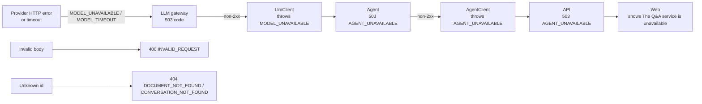
```mermaid
flowchart LR
    prov["Provider HTTP error<br/>or timeout"] -->|"MODEL_UNAVAILABLE / MODEL_TIMEOUT"| llm["LLM gateway<br/>503 code"]
    llm -->|"non-2xx"| lc["LlmClient<br/>throws MODEL_UNAVAILABLE"]
    lc --> agent["Agent<br/>503 AGENT_UNAVAILABLE"]
    agent -->|"non-2xx"| ac["AgentClient<br/>throws AGENT_UNAVAILABLE"]
    ac --> api["API<br/>503 AGENT_UNAVAILABLE"]
    api --> web["Web<br/>shows The Q&A service is unavailable"]
    val["Invalid body"] --> v400["400 INVALID_REQUEST"]
    nf["Unknown id"] --> v404["404 DOCUMENT_NOT_FOUND / CONVERSATION_NOT_FOUND"]
```

## 16. Configuration flow

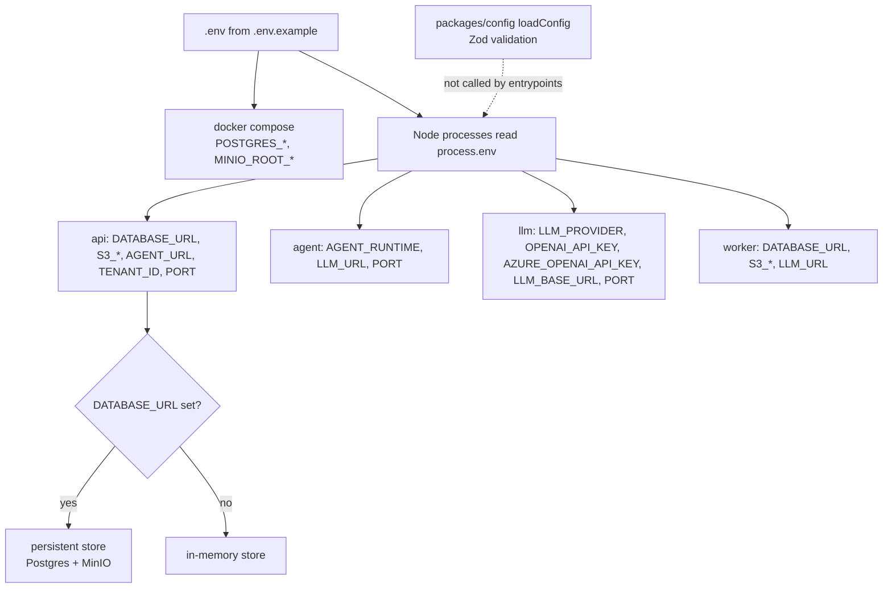
```mermaid
flowchart TD
    envfile[".env from .env.example"] --> compose["docker compose<br/>POSTGRES_*, MINIO_ROOT_*"]
    envfile --> procs["Node processes read process.env"]
    procs --> apiE["api: DATABASE_URL, S3_*, AGENT_URL, TENANT_ID, PORT"]
    procs --> agentE["agent: AGENT_RUNTIME, LLM_URL, PORT"]
    procs --> llmE["llm: LLM_PROVIDER, OPENAI_API_KEY, AZURE_OPENAI_API_KEY, LLM_BASE_URL, PORT"]
    procs --> workE["worker: DATABASE_URL, S3_*, LLM_URL"]
    cfg["packages/config loadConfig<br/>Zod validation"] -. "not called by entrypoints" .-> procs
    apiE --> sw{"DATABASE_URL set?"}
    sw -- yes --> persistent["persistent store<br/>Postgres + MinIO"]
    sw -- no --> memory["in-memory store"]
```

## 17. Local deployment

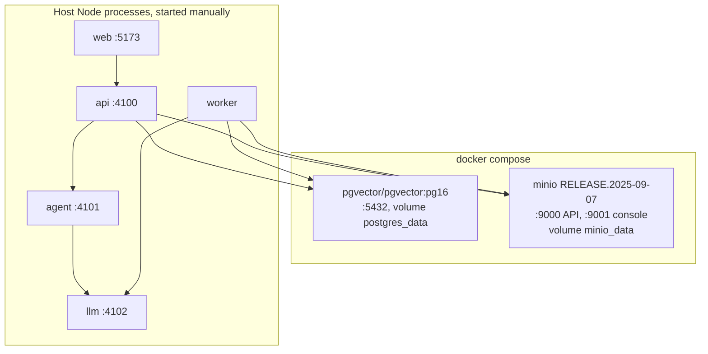
```mermaid
flowchart TB
    subgraph docker["docker compose"]
        pgc["pgvector/pgvector:pg16<br/>:5432, volume postgres_data"]
        mio["minio RELEASE.2025-09-07<br/>:9000 API, :9001 console<br/>volume minio_data"]
    end
    subgraph host["Host Node processes, started manually"]
        w5173["web :5173"]
        a4100["api :4100"]
        g4101["agent :4101"]
        l4102["llm :4102"]
        wk["worker"]
    end
    w5173 --> a4100 --> g4101 --> l4102
    a4100 --> pgc
    a4100 --> mio
    wk --> pgc
    wk --> mio
    wk --> l4102
```

## 18. Migration flow

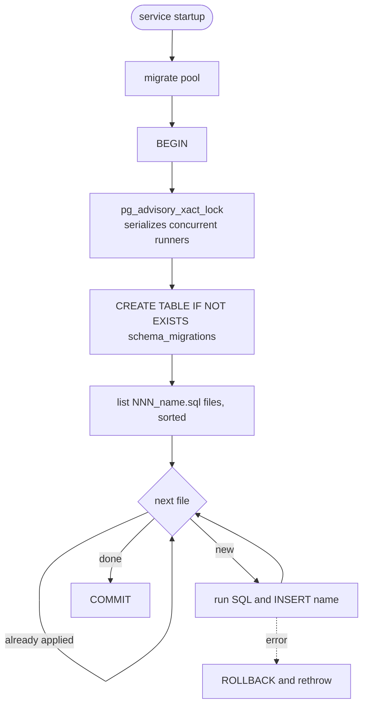
```mermaid
flowchart TD
    s([service startup]) --> m["migrate pool"]
    m --> b["BEGIN"]
    b --> lock["pg_advisory_xact_lock<br/>serializes concurrent runners"]
    lock --> tbl["CREATE TABLE IF NOT EXISTS schema_migrations"]
    tbl --> list["list NNN_name.sql files, sorted"]
    list --> loop{"next file"}
    loop -- already applied --> loop
    loop -- new --> run["run SQL and INSERT name"] --> loop
    loop -- done --> commit["COMMIT"]
    run -. error .-> rb["ROLLBACK and rethrow"]
```

## 19. Retrieval wiring: current vs intended

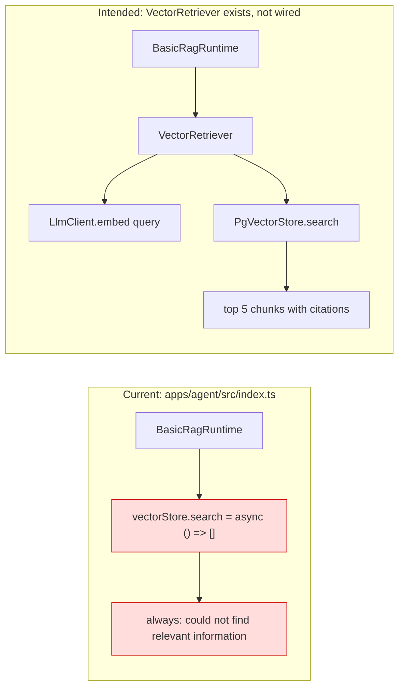
```mermaid
flowchart LR
    subgraph current["Current: apps/agent/src/index.ts"]
        direction TB
        b1["BasicRagRuntime"] --> stub["vectorStore.search = async () => []"]
        stub --> none["always: could not find relevant information"]
    end
    subgraph intended["Intended: VectorRetriever exists, not wired"]
        direction TB
        b2["BasicRagRuntime"] --> vr["VectorRetriever"]
        vr --> e["LlmClient.embed query"]
        vr --> pv["PgVectorStore.search"]
        pv --> chunks["top 5 chunks with citations"]
    end
    style stub fill:#fdd,stroke:#c00
    style none fill:#fdd,stroke:#c00
```

## 20. Web UI flow

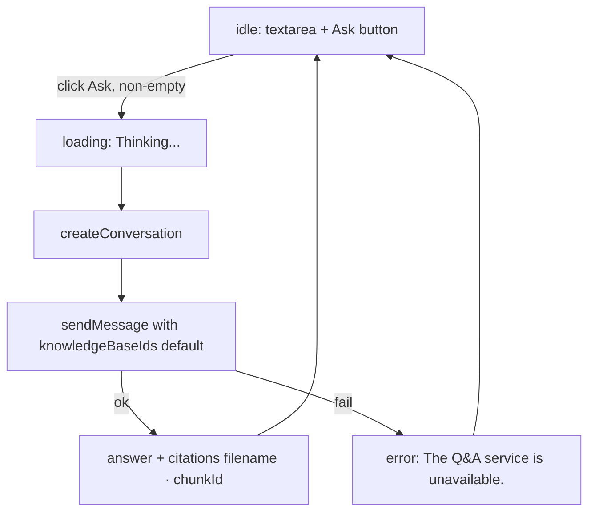
```mermaid
flowchart TD
    idle["idle: textarea + Ask button"] -->|"click Ask, non-empty"| load["loading: Thinking..."]
    load --> c["createConversation"] --> s["sendMessage with knowledgeBaseIds default"]
    s -->|ok| shown["answer + citations filename · chunkId"]
    s -->|fail| err["error: The Q&A service is unavailable."]
    shown --> idle
    err --> idle
```

## 21. Test layout

```mermaid
flowchart TD
    t["Vitest"] --> unit["Unit tests, no infrastructure"]
    t --> integ["Integration tests, need Docker"]
    unit --> u1["apps/api index.test.ts"]
    unit --> u2["apps/agent routes + basic-rag-runtime"]
    unit --> u3["apps/llm provider-registry + mock-provider"]
    unit --> u4["apps/worker chunker, worker, process-ingestion-job"]
    unit --> u5["packages/contracts, packages/config"]
    unit --> u6["domain pgvector-store, minio-object-store"]
    unit --> u7["tests/smoke/workspace"]
    integ --> i1["postgres-repositories.integration.test.ts"]
    integ --> i2["minio-object-store.integration.test.ts"]
```

## 22. Extension points

```mermaid
flowchart LR
    np["New LLM provider"] --> i1["implement LlmProvider"] --> r1["register in provider-registry.ts"] --> c1["add name to LLM_PROVIDER enum in config"]
    nr["New agent runtime"] --> i2["implement answer"] --> r2["register in runtime-registry.ts"]
    ne["New file type"] --> i3["implement DocumentExtractor"] --> r3["add to worker extractors list"]
    ns["Schema change"] --> i4["add NNN_name.sql migration"]
    nc["New contract"] --> i5["add Zod schema in packages/contracts and export"]
```
